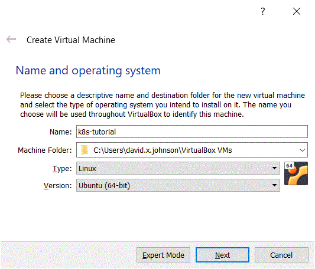

# k8s-tutorial
## Setup > vBox

** **IMPORTANT:** These instructions are only for Windows hosts.

---
The vBox install binaries are located [here](https://www.virtualbox.org/wiki/Downloads). Choose the Windows download link to get the installer.

Here are the vBox Manager installation instructions for [Windows](https://docs.oracle.com/en/virtualization/virtualbox/6.1/user/installation.html#installation_windows).

Once the vBox Manager is installed, launch the vBox Manager, click on the `Machine` drop-down, then click on `New` to create a new Linux guest OS. The following pop-up will appear:

Select the settings that match the image above and click on `Next`. All the defaults are adequate. <!--, but you can also go down a rabbit hole by clicking on `Expert Mode` [here](https://docs.oracle.com/en/virtualization/virtualbox/6.1/user/BasicConcepts.html#guestossupport).-->

<!--One of the more useful features is a [shared folder](https://docs.oracle.com/en/virtualization/virtualbox/6.1/user/BasicConcepts.html#shared-folders) between the Linux guest and the Windows Host. -->
